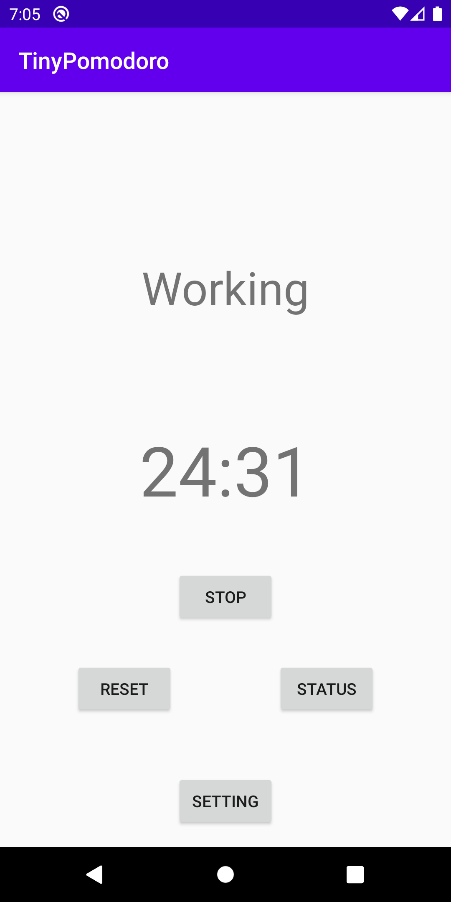

# TinyPomodoro
Tiny pomodoro timer

# Feature
- Kotlin
- Simple

## Screenshot

## Build & Install
- Please install `Android Stduio`
- Please import this repository to `Android Studio`

## Usage
The timer starts when you push the start button.

## TODO
- [ ] Setting UI
- [ ] Long breaking
- [ ] Display remaining time in notification field

## LICENSE
- MIT License
